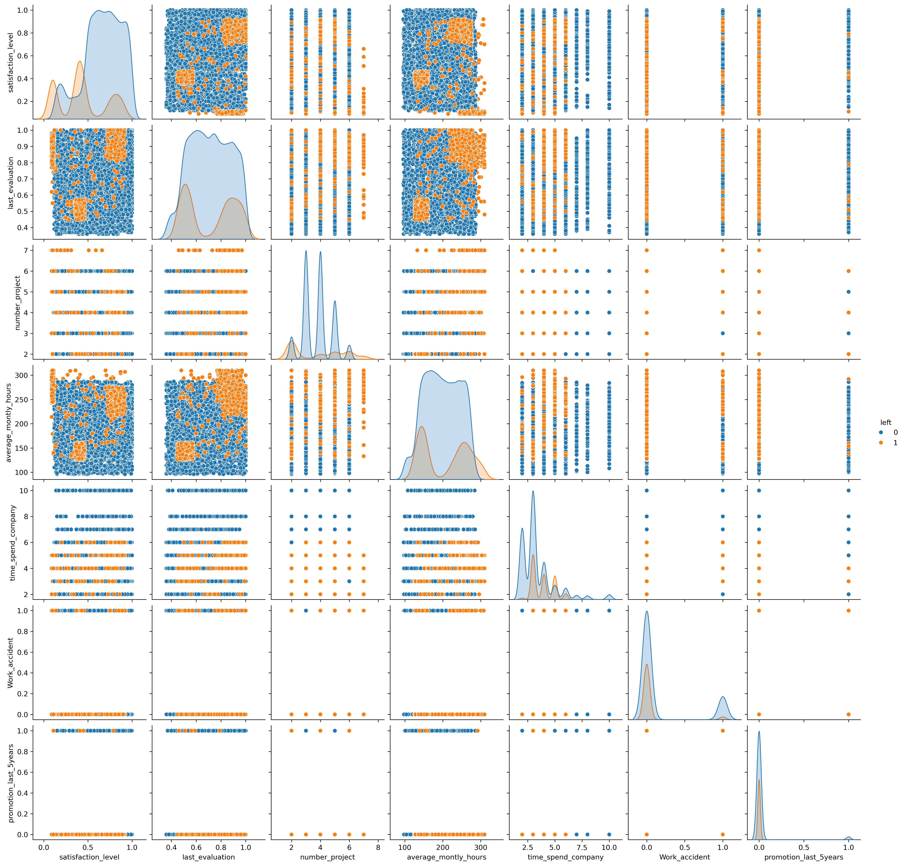
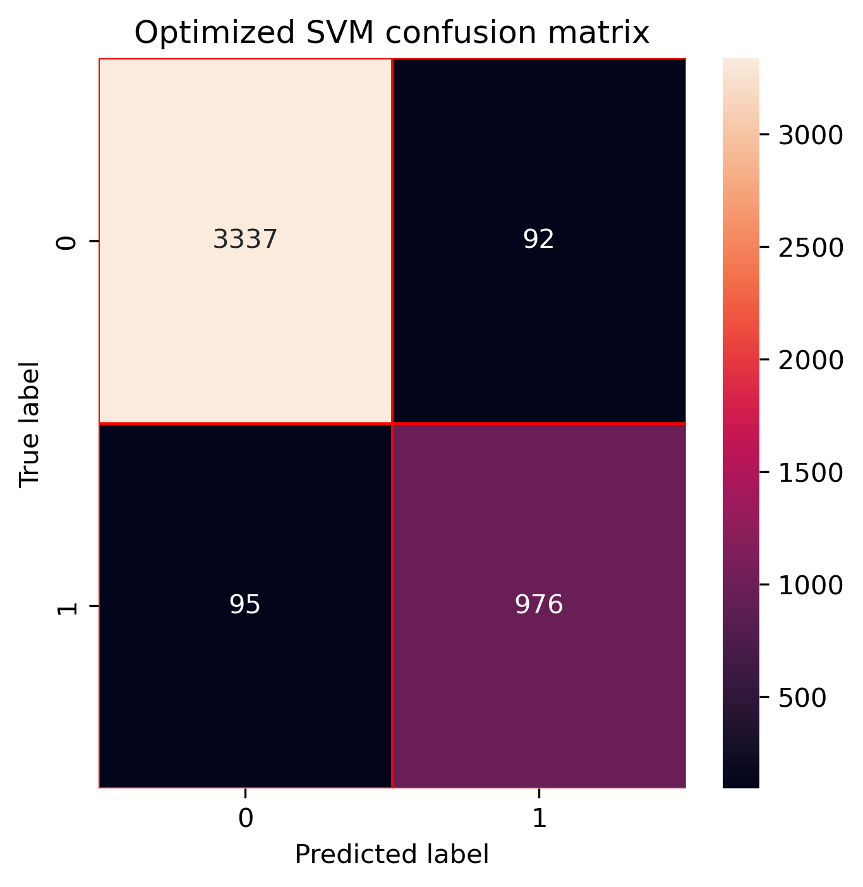

# Employee attrition prediction using Support Vector Machines (SVM)

## Project overview

Employee attrition is an important business problem because losing experienced employees can increase recruitment costs and reduce productivity.

This project develops Support Vector Machine (SVM) classifiers to predict whether an employee is likely to leave the company based on workplace and employee-related characteristics.

## Objectives

- Explore and preprocess employee attrition data.
- Encode categorical variables and standardize numerical features.
- Train an SVM classification model.
- Optimize model hyperparameters using GridSearchCV.
- Evaluate model performance using confusion matrices, precision, recall, F1-score, and accuracy.
- Compare the baseline and optimized models.

## Dataset

The dataset contains employee-related variables such as satisfaction level, performance evaluation, number of projects, average monthly hours, time spent at the company, salary level, and department.

The target variable is `left`:

- `0`: Employee stayed at the company.
- `1`: Employee left the company.

Dataset file: `recursos_humanos.csv`

## Exploratory data analysis

The pairplot provides an overview of the relationships between employee characteristics and attrition.

## Methodology

The project follows these main steps:

1. Exploratory data analysis.
2. Data preprocessing and categorical feature encoding.
3. Train-test split.
4. Feature standardization using `StandardScaler`.
5. SVM model training.
6. Hyperparameter optimization using `GridSearchCV`.
7. Model evaluation using classification metrics and confusion matrices.

## Hyperparameter optimization

GridSearchCV was used to evaluate different SVM configurations. The optimized model selected an RBF kernel with:

- `C = 10`
- `gamma = scale`
- `kernel = rbf`

## Model evaluation

The baseline and optimized models were evaluated using:

- Confusion matrix
- Accuracy
- Precision
- Recall
- F1-score

Precision and recall were also calculated manually from the confusion matrix to verify the results reported by Scikit-learn.
### Baseline model

### Optimized model

## Results

Both the baseline and optimized SVM models achieved strong classification performance. Hyperparameter optimization produced only a modest change in performance, indicating that the baseline SVM was already effective for this dataset.

Because employee attrition is an imbalanced classification problem, metrics such as precision, recall, and F1-score are particularly useful when evaluating the attrition class.

## Future improvements

Future work could include:

- Optimizing hyperparameters using F1-score as the GridSearchCV scoring metric.
- Comparing SVM with additional classification algorithms.
- Exploring additional feature engineering techniques.
- Using cross-validation for more robust model comparison.

## Repository structure

- `employee_attrition_svm.ipynb` — Complete analysis and machine learning workflow.
- `recursos_humanos.csv` — Dataset used in the project.
- `README.md` — Project documentation. 
